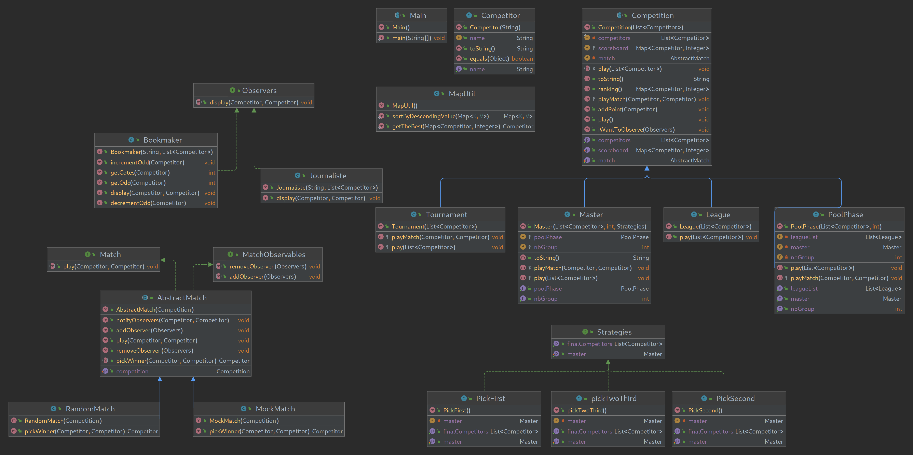

# ProjetCoo Competition

Auteur: 
- Youva Kaoui

Date de début : 21/09/2022

Date de fin : 11/12/2022

#
## Présentation du Projet Competition sportive

  

Une compétition sportive est définie par un ensemble de matchs joués entre compétiteurs. La compétition est responsable de l’organisation de ses matchs. Autrement dit, c’est elle qui fait jouer ses matchs. La méthode play() déroule donc une compétition jusqu’à son terme, c’est-à-dire lorsque tous les matchs ont été joués et qu’un vainqueur est désigné. Organiser une compétition consiste donc à faire jouer successivement chaque match de la compétition. Il est possible de jouer plusieurs types de compétitions, des tournois, des leagues... Tout au long des jeux, un journaliste et un bookmaker suivent de près les résultats des matchs, l'un commente, l'autre modifie les côtes selon les résultats.

## Plan de conception UML

## Livrable 1
Le Livrable I du projet competition consisté à coder un programme permettant créer des compétitions, des jours, et des matches. Les jours s'affrontent dans 2 types de compétitions, des leagues et de Tournament.

- Dans le cadre du tournoi Seul les compétiteurs ayant
gagné leur match lors d’un tour participe au tour suivant les vainqueurs de chaque match se rencontrent ainsi entre eux jusqu'à ce qu’il n’en reste plus qu’un, déclaré alors vainqueur du tournoi.

- Dans le cadre de la Ligue se jouent en matchs aller-retour Chaque comp ́etiteur rencontré donc 2 fois chacun des autres comp ́etiteurs du championnat. À l'issue du championnat, le vainqueur est donc le compétiteur ayant cumulé le plus grand nombre de victoires.
#
## Livrable 2 
Le Livrable 2 du projet competition consiste à rajouter quelques fonctionnalités supplémentaires par-dessus le livrable I. les fonctionnalités qui ont été ajoutées sont les strageties : 

- PickFirst qui prend le premier de chaque phase
- PickTwoThird Elle permet de choisir les 2 premiers  concurrents de chaque ligue et le suivant qui a le plus de points.
- PickSecond qui permet de sélectionner les deux meilleurs compétiteurs de chaque ligue dans le master
#
## Livrable 3

Le livrable 3 du projet compétition consiste à ajouter une nouvelle fonctionnalité, les observateurs. Leur rôle est d'observer une compétition et de pouvoir réagir suite aux résultats des matchs. Il y a deux types d'observateurs : 

- Le bookmaker qui observe les compétiteurs dans une compétition et détermine ses côtes pour chaque compétiteur.
- Le journaliste qui commente le match.

#
## Instructions d'utilisation :

1) Cloner le dépot: 
    - via ssh

            git clone git@gitlab-etu.fil.univ-lille.fr:youva.kaoui.etu/coo.git 

    - via https

            git clone https://gitlab-etu.fil.univ-lille.fr/youva.kaoui.etu/coo.git

2) Compiler les classes 
    - Ce placer à la racine du projet et utiliser le Makefile

            make competition

3) Lancer le projet competition

    - Ce déplacer dans le dossier classes/

            cd classes/

    - Créer un éxécutable ".jar"

            jar cfm ../competition.jar ../META-INF/MANIFEST.MF competitions/*.class competitions/competitors/*.class competitions/strategies/*.class competitions/observers/*.class  competitions/matches/*.class  Main.class competitions/utiles/*.class

4) lancer l'éxécutable competition.jar

    - Ce déplacer racine 

            cd ../
    - lancer l'éxécutable competition.jar

            java -jar competition.jar

5) Enjoy :)
#
## Lancement des tests :

1) Compiler les tests

   - Ce placer à la racine du projet et utiliser le Makefile

         make test

1) Lancer les tests
   - Ce placer à la racine du projet et utiliser le Makefile

         make runtest

5) Enjoy :)
#
## Java Doc:

1) Créer la java doc 
   - Ce placer à la racine du projet et utiliser le Makefile

         javadoc -sourcepath src -d docs -subpackages competitions 

2) Ouvrire la documentation 
   - Si vous avez firefox installé :

         firefox docs/competitions/package-summary.html

   - Si vous utilisez un autre navigateur, avec votre navigateur préféré, lancer package-summary.html qui ce situe dans : 

         cd /docs/competitions/

5) Enjoy :)
#
## Exemple de trace d'éxecution d'une competition:

<pre> youva@Asus  ~/gitL3/coo/coo   main ±  java -jar competition.jar
Picked up _JAVA_OPTIONS: -Dawt.useSystemAAFontSettings=on -Dswing.aatext=true

DEBUT D&apos;UNE COMPETITION MASTER AVEC LA STRATEGIE PickFirst 
Blastoff vs Drift

 -------ACTUALITE SPORTIVE-------
l&apos;equipe21 est fiere de vous présenter l&apos;actualité sportive.

Dans se match oposant Drift à Blastoff
Drift arrache la victoire, quant à Blastoffest définitvement au fond du trou

 -------PARIS SPORTIFS-------
suite à la vistoire de Drift votre Bookmaker preféré Betclick, 
vous annonce les nouvelles côtes : 

Les côtes actuelles sont pour : 
côte de : Blastoff =&gt; 3
côte de : Drift =&gt; 3
côte de : Lynx =&gt; 3
côte de : Raven =&gt; 3
côte de : Catalyst =&gt; 3
côte de : Midas =&gt; 3
côte de : Map =&gt; 3
côte de : Blastoff =&gt; 3
---
Les nouvelles côtes sont pour :
côte de : Blastoff =&gt; 4
côte de : Drift =&gt; 2
côte de : Lynx =&gt; 3
côte de : Raven =&gt; 3
côte de : Catalyst =&gt; 3
côte de : Midas =&gt; 3
côte de : Map =&gt; 3
côte de : Blastoff =&gt; 3
------------------------------------------------------
</pre>

## Exemple de trace d'éxecution des tests:

<pre> youva@Asus  ~/gitL3/coo/coo   main ±  make test
make: Dépendance circulaire test &lt;- test abandonnée.
javac -d classes -cp ./lib/*.jar ./tests/*.java ./src/Main.java ./src/competitions/strategies/*.java ./src/competitions/observers/*.java ./src/competitions/*.java ./src/competitions/competitors/*.java ./src/competitions/matches/*.java ./src/competitions/utiles/*java
Picked up _JAVA_OPTIONS: -Dawt.useSystemAAFontSettings=on -Dswing.aatext=true
 youva@Asus  ~/gitL3/coo/coo   main ±  make runtest
make: Dépendance circulaire runtest &lt;- runtest abandonnée.
java -jar ./lib/junit-platform-console-standalone-1.9.0.jar -cp classes --scan-classpath --disable-banner
Picked up _JAVA_OPTIONS: -Dawt.useSystemAAFontSettings=on -Dswing.aatext=true
Earth vs Mars
Mars vs Earth
j&apos;affiche le classement
*** League Ranking ***
Mars - 1
Earth - 1

Mercury vs Venus
Venus vs Mercury
j&apos;affiche le classement
*** League Ranking ***
Venus - 2
Mercury - 0

Earth vs Mars
Mars vs Earth
j&apos;affiche le classement
*** League Ranking ***
Mars - 1
Earth - 1

Mercury vs Venus
Venus vs Mercury
j&apos;affiche le classement
*** League Ranking ***
Venus - 1
Mercury - 1

 -------PARIS SPORTIFS-------
suite à la vistoire de Player 1 votre Bookmaker preféré b1, 
vous annonce les nouvelles côtes : 

Les côtes actuelles sont pour : 
côte de : Player 1 =&gt; 3

...
</pre>
<pre>Espagne vs Algerie
Espagne vs France
Espagne vs Italie
╷
├─ JUnit Jupiter ✔
│  ├─ PoolPhaseTest ✔
│  │  ├─ dplayThrowsRuntimeExceptionWhenTryingToCreatInequalGroups() ✔
│  │  ├─ minimNumberPlayers() ✔
│  │  └─ leagueListeBeforePlayIsEmpty() ✔
│  └─ BookmakerTest ✔
│     ├─ testDecrementOdd() ✔
│     ├─ testDecrementOddBelowMinimum() ✔
│     ├─ testIncrementOdd() ✔
│     ├─ testInitialOdds() ✔
│     └─ testDisplay() ✔
├─ JUnit Vintage ✔
│  ├─ CompetitorTest ✔
│  │  └─ testNameOfCompetitors ✔
│  ├─ TournamentTest ✔
│  │  ├─ matchIsCorrectlyPlayed ✔
│  │  ├─ playCreatesTheRightAmountOfMatchesNotPower2 ✔
│  │  └─ playCreatesTheRightAmountOfMatchesPower2 ✔
│  └─ LeagueTest ✔
│     ├─ matchIsCorrectlyPlayed ✔
│     ├─ playCreatesTheRightAmountOfMatches ✔
│     ├─ playIsOrderedByScores ✔
│     └─ playIsCorrectlyPlayed ✔
└─ JUnit Platform Suite ✔

Test run finished after 153 ms
[         8 containers found      ]
[         0 containers skipped    ]
[         8 containers started    ]
[         0 containers aborted    ]
[         8 containers successful ]
[         0 containers failed     ]
[        16 tests found           ]
[         0 tests skipped         ]
[        16 tests started         ]
[         0 tests aborted         ]
[        16 tests successful      ]
[         0 tests failed          ]
</pre>